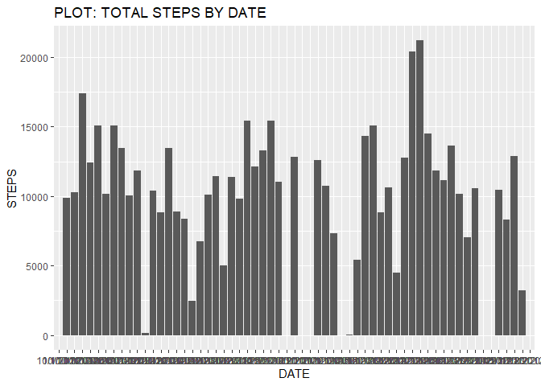
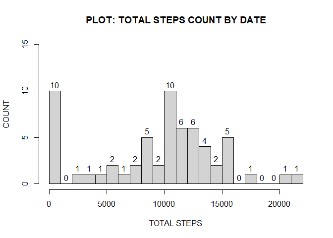
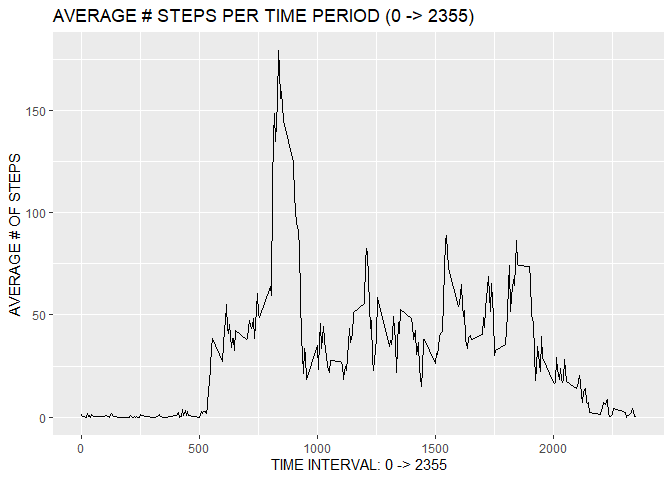
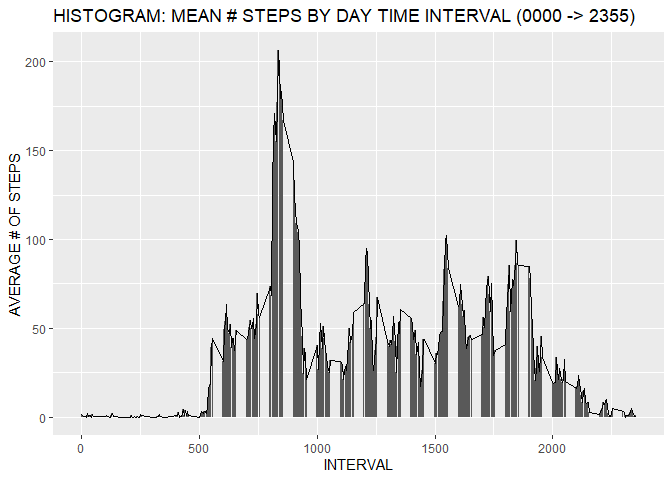
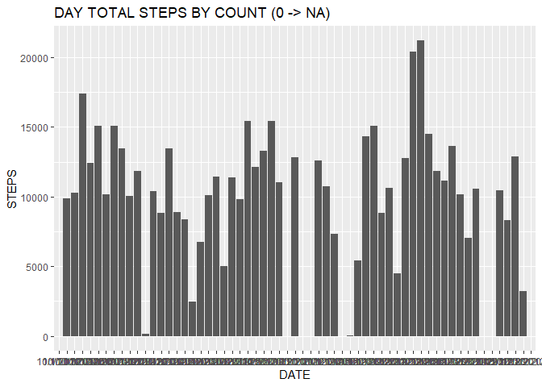
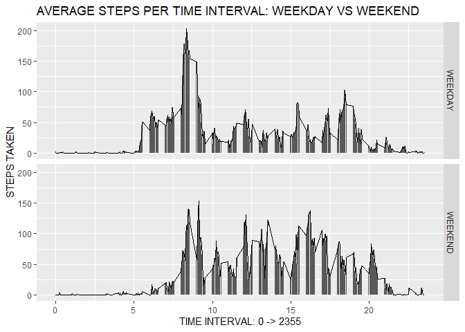

## FOLLOWING: VERBIAGE, SCRIPTS & PLOTS THAT ANSWER QUESTIONS
## FOR ASSIGNMENT OF REPRODUCIBLE RESEARCH WEEK 2

### BACKGROUND (briefed from course assignment document)
*	data from a personal activity monitoring device
      Fitbit, Nike Fuelband or Jawbone Up)
*	data consists of 2 months of data from anonymous individual collected during 
  months of October & November 2012
*	device collected data at 5 minute intervals throughout day
*	data for assignment downloaded from course web site - Activity monitoring data
*	dataset variables:
* 1) steps: # of steps taken in 5-minute interval 
*           missing values (NA) exist
* 2) date: date when measurement taken -> MM/DD/YYYY format
* 3) interval: identifies 5-minute interval when measurement taken
*           0 to 2355 values for each date
* 	        dataset stored in CSV file
* 	        dataset has 17,569 rows (row 1 headings & 17,568 observations)

### QUESTION #1: What is the R code for reading the assignment dataset?

```r
## CODE FOR READING IN DATASET FOR ASSIGNMENT

## FILE FROM ASSIGNMENT WAS DOWNLOADED IN LINK: Activity Monitoring Data
## FILE THEN SET INTO MY OWN AREA FOR PROCESSING
setwd("C:/Users/misc/Documents/COURSERA/R PROGRAMMING/RR W2 ASSIGNMENT/")

## READ ENTIRE CSV FILE INTO DATA FRAME RRW2DATA
## NOTE: RRW2DATA -> RR (REPRODUCIBLE RESEARCH) + W2 (WEEEK2) + DATA 
RRW2DATA <- data.table::fread(input = "activity.csv")

## RRW2DATA INFORMATION
dim(RRW2DATA)
```

```
## [1] 17568     3
```

```r
names(RRW2DATA)
```

```
## [1] "steps"    "date"     "interval"
```

```r
head(RRW2DATA)
```

```
##    steps      date interval
## 1:    NA 10/1/2012        0
## 2:    NA 10/1/2012        5
## 3:    NA 10/1/2012       10
## 4:    NA 10/1/2012       15
## 5:    NA 10/1/2012       20
## 6:    NA 10/1/2012       25
```

```r
str(RRW2DATA)
```

```
## Classes 'data.table' and 'data.frame':	17568 obs. of  3 variables:
##  $ steps   : int  NA NA NA NA NA NA NA NA NA NA ...
##  $ date    : chr  "10/1/2012" "10/1/2012" "10/1/2012" "10/1/2012" ...
##  $ interval: int  0 5 10 15 20 25 30 35 40 45 ...
##  - attr(*, ".internal.selfref")=<externalptr>
```

```r
## GET DATE COLUMN IN YYYY-MM-DD FORMAT
RRW2DATA$date <- as.Date(RRW2DATA$date,format = "%M/%d/%y")

## TOTAL # OF INTERVALS WITH MISSING # OF STEPS REPORTED
NOSTEPS <- sum(is.na(RRW2DATA$steps))

print(paste0("# INTERVALS WITH STEPS = NA : ", NOSTEPS))
```

```
## [1] "# INTERVALS WITH STEPS = NA : 2304"
```

```r
## TOTAL # OF STEPS IN DATASET (na VALUES OMITTED)
TOTALSTEPS <- sum(RRW2DATA$steps, na.rm = TRUE)
print(paste0("# STEPS REPORTED : ", TOTALSTEPS))
```

```
## [1] "# STEPS REPORTED : 570608"
```
### ANSWER #1: REVIEW OF ACTIVITY FILE
A) fread of data table ‘activity.csv’
B) activity data set information:
   1) dimensions – 17568 rows X 3 columns
*     NOTE: 1 day has 288 readings (24 hours X 12 readings/hour)
*           days of data = 17568 readings/288 readings per day 
*           days of data = 61 days
   2) column names: ‘steps’ ‘date’ ‘interval’
   3) structure of dataset:
      A) ‘steps’ – integer
      B) ‘date’ – character (initially mm/dd/yyyy format)
      C) ‘interval’ – integer (0 -> 2355)
*        NOTE: 5 minute increments so 12 intervals/ hour  X 24 hours/day 
*              = 288 intervals (readings) /day) 
   4) times that NA reported: 2304 (all in step count)
   5) total steps reported: 570,608
C) NOTE: activity data set will be read for each question since changes 
         can be made to it in getting correct answer(s) for particular question

### QUESTION #2: What is total number of steps taken per day?
* ignore any NA values in data read
* make plots: 1) total steps / day & 2) count of frequency of total steps / day

```r
## PLOT: STEPS TAKEN PER DAY
## HISTOGRAM: FREQUENCY COUNT OF TOTAL # OF STEPS TAKEN PER DAY IN TIME PERIOD
## NOTE: NA VALUE FOR TIME INTERVAL REMOVED TO ALLOW CALCULATION OF STEPS PER DAY 

library(dplyr)
```

```
## 
## Attaching package: 'dplyr'
```

```
## The following objects are masked from 'package:stats':
## 
##     filter, lag
```

```
## The following objects are masked from 'package:base':
## 
##     intersect, setdiff, setequal, union
```

```r
setwd("C:/Users/misc/Documents/COURSERA/R PROGRAMMING/RR W2 ASSIGNMENT/")

## NOTE: ASSIGNMENT FILE DOWNLOADED INTO OWN COMPUTER
## CODE FOR READING DATA SET IN ASSIGNMENT
## READ ENTIRE CSV FILE INTO DATASET RRW2DATA
RRW2DATA <- data.table::fread(input = "activity.csv")

## IF NA EXISTS IN A COLUMN -> THAT ROW REMOVED       
DAYSTEPS <- RRW2DATA[,c(lapply(.SD,sum,na.rm = TRUE)),
                     .SDcols = c("steps"), by = .(date)]
colnames(DAYSTEPS) <- c("DATE","STEPS")

## PRINTING # STEPS REPORTED
print(paste0("total # steps in file = ", DAYSTEPS))
```

```
## [1] "total # steps in file = c(\"10/1/2012\", \"10/2/2012\", \"10/3/2012\", \"10/4/2012\", \"10/5/2012\", \"10/6/2012\", \"10/7/2012\", \"10/8/2012\", \"10/9/2012\", \"10/10/2012\", \"10/11/2012\", \"10/12/2012\", \"10/13/2012\", \"10/14/2012\", \"10/15/2012\", \"10/16/2012\", \"10/17/2012\", \"10/18/2012\", \"10/19/2012\", \"10/20/2012\", \"10/21/2012\", \"10/22/2012\", \"10/23/2012\", \"10/24/2012\", \"10/25/2012\", \"10/26/2012\", \"10/27/2012\", \"10/28/2012\", \"10/29/2012\", \"10/30/2012\", \"10/31/2012\", \"11/1/2012\", \"11/2/2012\", \"11/3/2012\", \"11/4/2012\", \"11/5/2012\", \"11/6/2012\", \n\"11/7/2012\", \"11/8/2012\", \"11/9/2012\", \"11/10/2012\", \"11/11/2012\", \"11/12/2012\", \"11/13/2012\", \"11/14/2012\", \"11/15/2012\", \"11/16/2012\", \"11/17/2012\", \"11/18/2012\", \"11/19/2012\", \"11/20/2012\", \"11/21/2012\", \"11/22/2012\", \"11/23/2012\", \"11/24/2012\", \"11/25/2012\", \"11/26/2012\", \"11/27/2012\", \"11/28/2012\", \"11/29/2012\", \"11/30/2012\")"
## [2] "total # steps in file = c(0, 126, 11352, 12116, 13294, 15420, 11015, 0, 12811, 9900, 10304, 17382, 12426, 15098, 10139, 15084, 13452, 10056, 11829, 10395, 8821, 13460, 8918, 8355, 2492, 6778, 10119, 11458, 5018, 9819, 15414, 0, 10600, 10571, 0, 10439, 8334, 12883, 3219, 0, 0, 12608, 10765, 7336, 0, 41, 5441, 14339, 15110, 8841, 4472, 12787, 20427, 21194, 14478, 11834, 11162, 13646, 10183, 7047, 0)"
```

```r
DAYSTEPSDF <- data.frame(DAYSTEPS)

library(ggplot2)

## PLOT OF TOTAL STEPS TAKEN PER EACH DAY (NA VALUES OMITTED)
ggplot(DAYSTEPSDF, mapping = aes(y=STEPS,x=DATE)) +
  geom_bar(stat="identity") +
  xlab("DATE") +
  ylab("STEPS") +
  ggtitle("PLOT: TOTAL STEPS BY DATE")   
```

<!-- -->

```r
##   HISTOGRAM OF TOTAL # STEPS TAKEN EACH DAY (NA OMITTED) COUNT
hist(DAYSTEPS$STEPS, ylim=c(0,15), breaks=20,
     labels = TRUE, xlab="TOTAL STEPS",ylab="COUNT",
     main="PLOT: TOTAL STEPS COUNT BY DATE")
```

<!-- -->

### ANSWER #2: OBSERVATIONS FROM PLOTS
A) From total steps per day plot:
   1) no daily trend revealed (could be due to NA values)
   2) peaks & valleys exist
B) From frequency count plot:
   1) 0 -> 1000 & 10,000 -> 11,000 steps 10 count frequency
     (0 -> 1000 would include days of NA values)
   2)  several increments had 0 count

### QUESTION 3: What is mean total number of steps taken each day?
* ignore any NA values in data read
* calculate median also for comparison
* NOTE: dataset from assignment shows NA steps for 8 days
* HENCE: calculation of mean will be using 53 days

```r
## MEAN & MEDIAN FOR # STEPS TAKEN EACH DAY (NA VALUES OMITTED)

library(dplyr)
setwd("C:/Users/misc/Documents/COURSERA/R PROGRAMMING/RR W2 ASSIGNMENT/")

## NOTE: ASSIGNMENT FILE DOWNLOADED INTO OWN COMPUTER
## CODE FOR READING IN DATASETAND/OR PROCESSING THE DATA
## READ ENTIRE DATA CSV FILE INTO A DATA FRAME
RRW2DATA <- data.table::fread(input = "activity.csv")

## GET # STEPS MADE PER DAY BY SUMMING THE 288 OBSERVATIONS OF THAT DAY
## CREATE FILE OF 'DATE' & 'TOTAL # STEPS'
DAYSTEPS <- RRW2DATA %>%
            group_by(date) %>%
            summarise(TOTALSTEPS = sum(steps))
```

```
## `summarise()` ungrouping output (override with `.groups` argument)
```

```r
print(DAYSTEPS, n = 61)
```

```
## # A tibble: 61 x 2
##    date       TOTALSTEPS
##    <chr>           <int>
##  1 10/1/2012          NA
##  2 10/10/2012       9900
##  3 10/11/2012      10304
##  4 10/12/2012      17382
##  5 10/13/2012      12426
##  6 10/14/2012      15098
##  7 10/15/2012      10139
##  8 10/16/2012      15084
##  9 10/17/2012      13452
## 10 10/18/2012      10056
## 11 10/19/2012      11829
## 12 10/2/2012         126
## 13 10/20/2012      10395
## 14 10/21/2012       8821
## 15 10/22/2012      13460
## 16 10/23/2012       8918
## 17 10/24/2012       8355
## 18 10/25/2012       2492
## 19 10/26/2012       6778
## 20 10/27/2012      10119
## 21 10/28/2012      11458
## 22 10/29/2012       5018
## 23 10/3/2012       11352
## 24 10/30/2012       9819
## 25 10/31/2012      15414
## 26 10/4/2012       12116
## 27 10/5/2012       13294
## 28 10/6/2012       15420
## 29 10/7/2012       11015
## 30 10/8/2012          NA
## 31 10/9/2012       12811
## 32 11/1/2012          NA
## 33 11/10/2012         NA
## 34 11/11/2012      12608
## 35 11/12/2012      10765
## 36 11/13/2012       7336
## 37 11/14/2012         NA
## 38 11/15/2012         41
## 39 11/16/2012       5441
## 40 11/17/2012      14339
## 41 11/18/2012      15110
## 42 11/19/2012       8841
## 43 11/2/2012       10600
## 44 11/20/2012       4472
## 45 11/21/2012      12787
## 46 11/22/2012      20427
## 47 11/23/2012      21194
## 48 11/24/2012      14478
## 49 11/25/2012      11834
## 50 11/26/2012      11162
## 51 11/27/2012      13646
## 52 11/28/2012      10183
## 53 11/29/2012       7047
## 54 11/3/2012       10571
## 55 11/30/2012         NA
## 56 11/4/2012          NA
## 57 11/5/2012       10439
## 58 11/6/2012        8334
## 59 11/7/2012       12883
## 60 11/8/2012        3219
## 61 11/9/2012          NA
```

```r
## PRINT # OF DAYS OF OBSERVATIONS
print(paste0("# DAYS (na INCLUDED) OF OBSERVATIONS = ", nrow(DAYSTEPS)))
```

```
## [1] "# DAYS (na INCLUDED) OF OBSERVATIONS = 61"
```

```r
## FIND # OF ROWS WITH NA VALUES FOR STEPS
AMTNADAYS <- sum(is.na(DAYSTEPS$TOTALSTEPS))
print(paste0("# DAYS WITH NA OBSERVATIONS = ", AMTNADAYS))
```

```
## [1] "# DAYS WITH NA OBSERVATIONS = 8"
```

```r
## CREATE DATASET OF DATES FOR NA STEPS ONLY
NADAYS <- DAYSTEPS[is.na(DAYSTEPS$TOTALSTEPS), ]
print(NADAYS, n = AMTNADAYS)
```

```
## # A tibble: 8 x 2
##   date       TOTALSTEPS
##   <chr>           <int>
## 1 10/1/2012          NA
## 2 10/8/2012          NA
## 3 11/1/2012          NA
## 4 11/10/2012         NA
## 5 11/14/2012         NA
## 6 11/30/2012         NA
## 7 11/4/2012          NA
## 8 11/9/2012          NA
```

```r
## GET MEAN WHEN NA VALUES REMOVED IN CALCULATIONS
STEPSMEAN1 <- mean(DAYSTEPS$TOTALSTEPS, na.rm = TRUE)
STEPSMEAN1 <- round(STEPSMEAN1, digits = 2)
print(paste0("MEAN OF FILE WHEN NA VALUES OMITTED: ", STEPSMEAN1))
```

```
## [1] "MEAN OF FILE WHEN NA VALUES OMITTED: 10766.19"
```

```r
## GET MEDIAN WHEN NA VALUES REMOVED IN CALCULATIONS
STEPSMEDIAN1 <- median(DAYSTEPS$TOTALSTEPS, na.rm = TRUE)
print(paste0("MEDIAN OF FILE WHEN NA VALUES OMITTED: ", STEPSMEDIAN1))
```

```
## [1] "MEDIAN OF FILE WHEN NA VALUES OMITTED: 10765"
```

```r
## REMOVE NA VALUES FROM STEPS PER DAY FILE
DAYSTEPS = filter(DAYSTEPS, TOTALSTEPS != 'NA')
print(paste0("SHOW FILE WHEN NA VALUES REMOVED: "))
```

```
## [1] "SHOW FILE WHEN NA VALUES REMOVED: "
```

```r
DAYSTEPS
```

```
## # A tibble: 53 x 2
##    date       TOTALSTEPS
##    <chr>           <int>
##  1 10/10/2012       9900
##  2 10/11/2012      10304
##  3 10/12/2012      17382
##  4 10/13/2012      12426
##  5 10/14/2012      15098
##  6 10/15/2012      10139
##  7 10/16/2012      15084
##  8 10/17/2012      13452
##  9 10/18/2012      10056
## 10 10/19/2012      11829
## # ... with 43 more rows
```

```r
## PUT FILE IN INCREASING STEPS ORDER TO PREPARE TO FIND FILE MEDIAN
DAYSTEPS <- DAYSTEPS[order(DAYSTEPS$TOTALSTEPS), ]

## PRINT FILE MEDIAN WHEN FILE ORDERED BY # OF STEPS
print(paste0("VERIFY MEDIAN VALUE - 53 DAYS -> 27TH ENTRY IS MIDDLE"))
```

```
## [1] "VERIFY MEDIAN VALUE - 53 DAYS -> 27TH ENTRY IS MIDDLE"
```

```r
print(paste0(DAYSTEPS[27,]))
```

```
## [1] "11/12/2012" "10765"
```

```r
## VERIFY THAT # OF STEPS SAME
STEPSMADE <- sum(RRW2DATA$steps, na.rm = TRUE)
print(paste0("STEPS MADE: ", STEPSMADE))
```

```
## [1] "STEPS MADE: 570608"
```

```r
## NOTE: ASSIGNMENT FILE DOWNLOADED INTO OWN COMPUTER
## RE-READING DATA FOR DOING 0 REPLACEMENT OF NA VALUES
RRW2DATA <- data.table::fread(input = "activity.csv")

## CODE TO REPLACE NA VALUES IN DATASET STEPS COLUMN WITH 0  
library(imputeTS)
```

```
## Registered S3 method overwritten by 'quantmod':
##   method            from
##   as.zoo.data.frame zoo
```

```r
RRW2DATA$steps <- na_replace(RRW2DATA$steps, 0)

## CALCULATE # OF STEPS TAKEN EACH DAY
DAYSTEPS <- RRW2DATA %>%
  group_by(date) %>%
  summarise(TOTALSTEPS = sum(steps))
```

```
## `summarise()` ungrouping output (override with `.groups` argument)
```

```r
colnames(DAYSTEPS) <- c("DATE","TOTALSTEPS")

## USE TOTAL DAYS OF PERIOD AS 0 REPLACED NA VALUES
STEPSMEAN2 <- mean(DAYSTEPS$TOTALSTEPS)
print(paste0("MEAN OF FILE WHEN NA REPLACED BY 0: ", STEPSMEAN2))
```

```
## [1] "MEAN OF FILE WHEN NA REPLACED BY 0: 9354.22950819672"
```

```r
## USE TOTAL DAYS OF PERIOD AS 0 REPLACED NA VALUES
STEPSMEDIAN2 <- median(DAYSTEPS$TOTALSTEPS)
print(paste0("MEDIAN OF FILE WHEN NA REPLACED BY 0: ", STEPSMEDIAN2))
```

```
## [1] "MEDIAN OF FILE WHEN NA REPLACED BY 0: 10395"
```

```r
DAYSTEPS <- DAYSTEPS[order(DAYSTEPS$TOTALSTEPS), ]
print(DAYSTEPS[31, ])
```

```
## # A tibble: 1 x 2
##   DATE       TOTALSTEPS
##   <chr>           <dbl>
## 1 10/20/2012      10395
```

```r
STEPSTOTAL <- DAYSTEPS$TOTALSTEPS
sum(STEPSTOTAL)
```

```
## [1] 570608
```

```r
STEPSTOTAL
```

```
##  [1]     0     0     0     0     0     0     0     0    41   126  2492  3219
## [13]  4472  5018  5441  6778  7047  7336  8334  8355  8821  8841  8918  9819
## [25]  9900 10056 10119 10139 10183 10304 10395 10439 10571 10600 10765 11015
## [37] 11162 11352 11458 11829 11834 12116 12426 12608 12787 12811 12883 13294
## [49] 13452 13460 13646 14339 14478 15084 15098 15110 15414 15420 17382 20427
## [61] 21194
```

```r
NROW(DAYSTEPS)
```

```
## [1] 61
```
### ANSWER #3: MEAN & MEDIAN 
A) mean = 10766.19 steps/day
B) median = 10765 steps/day
C) recalculation for verification of mean & median calculations:      
  1) total # steps = 570,608
  2) period days = 61
  3) OBSERVATIONS = (PERIOD DAYS x 288 OBSERVATIONS/DAY) 
                    -
                    (OBSERVATIONS NOT MADE)
                    = (61 x 288) – 2304 
                    = 15,264
  4) OBSERVATION DAYS = OBSERVATIONS MADE/OBSERVATIONS PER DAY 
                      = 15,264 / 288
                      = 53 
  5) mean = TOTAL STEPS/OBSERVATIONS
          = 570,608/53
          = 10,766.19
  6)  REMEMBER: median of set of data is middlemost number in that data 
                (halfway into data after data first arranged in order 
                from least to greatest).  
      A) odd number of data given -> median is middle point number
      B) even number of data given -> median is ½ way between 
                                     number above & number below middle point
      C) if 61 days of observation -> median is 31st day steps
      D) if 53 days of observation -> median is 27th day of steps
  7) NOTE: for assignment dataset, no calculation required  
  8) NOTE: NA value CANNOT exist in data

### QUESTION #4: What is the average daily activity pattern?
1) plot to show average steps taken (y) each day (0 -> 2355) for period (x)
2) determination of which time 5-minute interval has most steps for day's period  

```r
##	TIME SERIES PLOT OF AVERAGE (mean) STEPS TAKEN PER TIME INTERVAL (0 -> 2355)

library(dplyr)
setwd("C:/Users/misc/Documents/COURSERA/R PROGRAMMING/RR W2 ASSIGNMENT/")

## NOTE: ASSIGNMENT FILE DOWNLOADED INTO OWN COMPUTER
## CODE FOR READING DATA SET IN ASSIGNMENT
## READ ENTIRE CSV FILE INTO DATASET RRW2DATA
RRW2DATA <- data.table::fread(input = "activity.csv")

## REMOVE NA VALUES FROM STEPS COLUMN
TIMESTEPS <- RRW2DATA[,c(lapply(.SD,sum,na.rm = TRUE)),
                     .SDcols = c("steps"), by = .(interval)]

colnames(TIMESTEPS) <- c("INTERVAL","STEPS")

## TOTAL # OF STEPS IN TIMESTEPS
TOTALSTEPS <- sum(TIMESTEPS$STEP, na.rm = FALSE)

## PRINT TOTAL # OF STEPS MADE
print(paste0("# OF TOTAL STEPS MADE = ", TOTALSTEPS))
```

```
## [1] "# OF TOTAL STEPS MADE = 570608"
```

```r
TIMESTEPSDF <- data.frame(TIMESTEPS)

## ADD COLUMN FOR # of OBSERVATION DAYS
TIMESTEPSDF$OBSERVEDAYS <- 61

## ADD COLUMN FOR INDIVIDUAL TIME INTERVAL MEANS
TIMESTEPSDF <- transform(TIMESTEPSDF, TIMEMEANS = STEPS / OBSERVEDAYS)

## CALCULATE TOTAL # OF TIME INTERVAL NEAMS (CHECK STEP)
RRW2MEANS <- sum(TIMESTEPSDF$TIMEMEANS, na.rm = FALSE)
print(paste0("# OF INTERVAL TIME MEANS = ", round(RRW2MEANS, digits = 2)))
```

```
## [1] "# OF INTERVAL TIME MEANS = 9354.23"
```

```r
library(ggplot2)
##	TIME SERIES PLOT OF AVERAGE (mean) STEPS TAKEN PER TIME INTERVAL (0 -> 2355)
ggplot(TIMESTEPSDF, mapping = aes(INTERVAL, TIMEMEANS)) +
       geom_line(col = "black") +
       xlab("TIME INTERVAL: 0 -> 2355") +
       ylab("AVERAGE # OF STEPS") +
       ggtitle("AVERAGE # STEPS PER TIME PERIOD (0 -> 2355)")
```

<!-- -->

### ANSWER #4A: DAILY PATTERN
* Plot shows that 7:30AM to 10AM has most activity

```r
## 5-minute interval that, on average, contains the maximum number of steps

library(dplyr)
setwd("C:/Users/misc/Documents/COURSERA/R PROGRAMMING/RR W2 ASSIGNMENT/")

## NOTE: ASSIGNMENT FILE DOWNLOADED INTO OWN COMPUTER
## CODE FOR READING DATA SET IN ASSIGNMENT
## READ ENTIRE CSV FILE INTO DATASET RRW2DATA
RRW2DATA <- data.table::fread(input = "activity.csv")

## CREATE DATA FILE OF INTERVAL TIME & STEPS ONLY - DATE NOT NEEDED
INTERVALSTEPS <- aggregate(RRW2DATA$steps,
                      by=list(RRW2DATA$interval),
                      na.rm=TRUE,
                      FUN=mean)
colnames(INTERVALSTEPS) <- c("INTERVAL","STEPSMEAN")

INTERVALSTEPSDF <- data.frame(INTERVALSTEPS) 

library(ggplot2)

## 5-MINUTE INTERVAL HISTOGAM TO REFLECT DATA OF AVERAGE # OF STEP ACTIVITY PLOT 
##   SHOWN PRIOR
ggplot(INTERVALSTEPSDF, mapping = aes(INTERVAL,STEPSMEAN)) +
  geom_bar(stat="identity") +
  geom_line(col = "black") +
  xlab("INTERVAL") +
  ylab("AVERAGE # OF STEPS") +
  ggtitle("HISTOGRAM: MEAN # STEPS BY DAY TIME INTERVAL (0000 -> 2355)")
```

<!-- -->

```r
## DATERMINE WHICH TIME INTERVAL (0 -> 2355) HAS MOST STEP & GREATEST MEAN FOR DATA GIVEN
INTERVALMEANMOST <- INTERVALSTEPS[which.max(INTERVALSTEPS$STEPSMEAN),]$INTERVAL
INTERVALMEANMOST
```

```
## [1] 835
```
### ANSWER #4B: DAILY PATTERN
A) time series plot & histogram plot look the same     
B) 5-minute interval having most steps: 835 (8:35 AM)

### QUESTION #5: What is the effect of missing values
A) report # of NA values in dataset 
B) detail what code needed to replace NA with ‘0’ for dataset 
C) compare mean & median results when NA replaced with ‘0’ vs NA omitted
D) detail impact of imputing missing data on results
E) create histogram of total steps taken each day after missing values imputed

```r
## EFFECT OF NA VALUES IN DATASET OMITTED VS CHANGED TO 0

library(dplyr)
setwd("C:/Users/misc/Documents/COURSERA/R PROGRAMMING/RR W2 ASSIGNMENT/")

## NOTE: ASSIGNMENT FILE DOWNLOADED INTO OWN COMPUTER
## CODE FOR READING DATASET GIVEN FOR ASSIGNMENT
## READ ENTIRE CSV FILE IN A DATA FRAME
RRW2DATA <- data.table::fread(input = "activity.csv")

## CALCULATE # STEPS MADE FOR DATASET
STEPSMADE <- sum(RRW2DATA$steps, na.rm = TRUE)
print(paste0("TOTAL STEPS = ", STEPSMADE))
```

```
## [1] "TOTAL STEPS = 570608"
```

```r
## SHOW # OF OBSERVATIONS (INTERVAL COUNT) IN DATASET
OBSERVED <- nrow(RRW2DATA)
print(paste0("OBSERVATIONS TOTAL: ", OBSERVED))
```

```
## [1] "OBSERVATIONS TOTAL: 17568"
```

```r
## FIND # OF INTERVALS WITH NA VALUES
NOSTEPS <- sum(is.na(RRW2DATA$steps))
print(paste0("OBSERVATIONS WITH NA: ", NOSTEPS))
```

```
## [1] "OBSERVATIONS WITH NA: 2304"
```

```r
## CALCULATE TOTAL # OF STEPS IN DATASET
DAYSTEPS <- RRW2DATA %>%
  group_by(date) %>%
  summarise(TOTALSTEPS = sum(steps))
```

```
## `summarise()` ungrouping output (override with `.groups` argument)
```

```r
## DETERMINE MEAN OF STEPS IN DATASET - NA REMOVED
STEPSMEAN1 <- mean(DAYSTEPS$TOTALSTEPS, na.rm = TRUE)
STEPSMEAN1 <- round(STEPSMEAN1, digits = 2)
print(paste0("MEAN IF NA REMOVED FROM CALCULATION: ", STEPSMEAN1))
```

```
## [1] "MEAN IF NA REMOVED FROM CALCULATION: 10766.19"
```

```r
## DETERMINE MEDIAN OF STEPS IN DATASET - NA REMOVED
STEPSMEDIAN1 <- median(DAYSTEPS$TOTALSTEPS, na.rm = TRUE)
STEPSMEDIAN1 <- round(STEPSMEDIAN1, digits = 2)
print(paste0("MEDIAN IF NA REMOVED FROM CALCULATION: ", STEPSMEDIAN1))
```

```
## [1] "MEDIAN IF NA REMOVED FROM CALCULATION: 10765"
```

```r
## CODE TO REPLACE NA VALUE WITH 0
library(imputeTS)
RRW2DATA$steps <- na_replace(RRW2DATA$steps, 0)

## CALCULATE # STEPS - NA REPLACED BY 0
INTERVALSTEPS <- RRW2DATA %>%
                 group_by(date) %>%
                 summarise(NUMBERSTEPS = sum(steps))
```

```
## `summarise()` ungrouping output (override with `.groups` argument)
```

```r
## DETERMINE MEAN OF STEPS IN DATASET - NA REPLACED BY 0
STEPSMEAN2 <- mean(INTERVALSTEPS$NUMBERSTEPS)
STEPSMEAN2 <- round(STEPSMEAN2, digits = 2)
print(paste0("MEAN IF NA CHANGED TO 0 IN CALCULATION: ", STEPSMEAN2))
```

```
## [1] "MEAN IF NA CHANGED TO 0 IN CALCULATION: 9354.23"
```

```r
## DETERMINE MEDIAN OF STEPS IN DATASET - NA REPLACED BY 0
STEPSMEDIAN2 <- median(INTERVALSTEPS$NUMBERSTEPS)
STEPSMEDIAN2 <- round(STEPSMEDIAN2, digits = 2)
print(paste0("MEDIAN IF NA CHANGED TO 0 IN CALCULATION: ", STEPSMEDIAN2))
```

```
## [1] "MEDIAN IF NA CHANGED TO 0 IN CALCULATION: 10395"
```

```r
DAY0 <- filter(INTERVALSTEPS, NUMBERSTEPS == 0)
DAY0
```

```
## # A tibble: 8 x 2
##   date       NUMBERSTEPS
##   <chr>            <dbl>
## 1 10/1/2012            0
## 2 10/8/2012            0
## 3 11/1/2012            0
## 4 11/10/2012           0
## 5 11/14/2012           0
## 6 11/30/2012           0
## 7 11/4/2012            0
## 8 11/9/2012            0
```

```r
DAY999 <- arrange(INTERVALSTEPS, NUMBERSTEPS)
print(DAY999[8, ])
```

```
## # A tibble: 1 x 2
##   date      NUMBERSTEPS
##   <chr>           <dbl>
## 1 11/9/2012           0
```

```r
print(DAY999[9, ])
```

```
## # A tibble: 1 x 2
##   date       NUMBERSTEPS
##   <chr>            <dbl>
## 1 11/15/2012          41
```

```r
print(DAY999[10, ])
```

```
## # A tibble: 1 x 2
##   date      NUMBERSTEPS
##   <chr>           <dbl>
## 1 10/2/2012         126
```

```r
##	HISTOGRAM OF STEPS TAKEN EACH DAY AFTER MISSING VALUES (NA) MADE 0

library(dplyr)
setwd("C:/Users/misc/Documents/COURSERA/R PROGRAMMING/RR W2 ASSIGNMENT/")

## NOTE: ASSIGNMENT FILE DOWNLOADED INTO OWN COMPUTER
## CODE FOR READING DATASET GIVEN FOR ASSIGNMENT
## READ ENTIRE CSV FILE IN A DATA FRAME
RRW2DATA <- data.table::fread(input = "activity.csv")

## FIND COLUMN(S) & COUNT IN EACH COLUMN THAT HAVE NA VALUE ORIGINALLY
colSums(is.na(RRW2DATA))
```

```
##    steps     date interval 
##     2304        0        0
```

```r
## CODE TO REPLACE NA VALUES IN DATASET STEPS COLUMN WITH 0  
library("imputeTS")
RRW2DATA$steps <- na_replace(RRW2DATA$steps, 0)

## CALCULATE # OF STEPS TAKEN EACH DAY
DAYSTEPS <- RRW2DATA[,c(lapply(.SD,sum,na.rm = FALSE)),
                     .SDcols = c("steps"), by = .(date)]
colnames(DAYSTEPS) <- c("DATE","STEPS")

DAYSTEPSDF <- data.frame(DAYSTEPS)

library(ggplot2)
## PLOT OF TOTAL STEPS TAKEN FOR EACH DAY (0 -> NA)

ggplot(DAYSTEPSDF, mapping = aes(y=STEPS,x=DATE)) +
  geom_bar(stat="identity") +
  xlab("DATE") +
  ylab("STEPS") +
  ggtitle("DAY TOTAL STEPS BY COUNT (0 -> NA)")   
```

<!-- -->

```r
## HISTOGRAM: TOTAL # OF STEPS TAKEN EACH DAY (0 -> NA)
hist(DAYSTEPS$STEPS, ylim=c(0,15), breaks=20,
     labels = TRUE, xlab="TOTAL STEPS", ylab="COUNT",
     main="DAY TOTAL STEPS BY COUNT (0 -> NA)")
```

<!-- -->

### ANSWER #5: MISSING VALUES
A) NOTE: after NA replaced by 0, following 8 dates showing 0 steps
          during 2012: 10/1, 10/8, 11/1, 11/4, 11/9, 11/10, 11/14, 11/30
B) NOTE: dates with > 0 & < 1000:  10/2 & 11/15 
C) NAs in dataset = 2304 (all in steps column of dataset read)
D) code to replace NA with 0:
   RRW2DATA$steps <- na_replace(RRW2DATA$steps, 0) 
   NOTE: code shown later for getting mean & median if 0 used
E) mean & median values if NA omitted or replaced by 0
    1) NA omitted: mean = 10766.19; median = 10765            
    2) NA replaced by 0: mean = 9354.23; median = 10395 
F) impact of using 0 for NA instead of omitting: 2304 more observations made
   1) If NA omitted: 53 observation days
   2) If NA changed to 0: 61 observation days
   3) mean per day = total steps/observation days
      A) mean per day = 570,608/53 if NA omitted
      B) mean per day = 570,608/61 if NA changed to 0
G) histogram for this question differs from 1-B: NO, does NOT differ

### QUESTION #6: What is difference of activity for weekdays vs weekends?
A) create new dataset that adds columns to original dataset:
   1) day of week for activity date
   2) determination of ‘weekday’ vs ‘weekend’ for that date
B) create panel plot of average steps taken per time 
     interval (x) vs weekdays days or weekend days of date period

### ANSWER #6: WEEKDAY VS WEEKEND
A) using dataset given for assignment, columns added by doing:
   1) adding column by taking dataset ‘date’ column 
     (format mm/dd/yyyy) and using ‘as.date’ function to add
      new column in yyyy-mm-dd format
   2) adding column for day of week that date is by using
     ‘weekdays’ function
   3) doing ‘ifelse’ test to determine if day is ‘weekday’ 
         or ‘weekend’
B) NOTE: code shown below does needed steps to create additional columns:
   1) date day  
   2) date being a weekday or on weekend 
C)  plots for weekday vs weekend look very similar

```r
## PANEL PLOT COMPARING AVERAGE # OF STEPS TAKEN PER 5 MINUTE INTERVAL: 
##                       WEEKDAYS VS WEEKENDS

library(dplyr)
setwd("C:/Users/misc/Documents/COURSERA/R PROGRAMMING/RR W2 ASSIGNMENT/")

## Read entire CSV file into a data frame
RRW2DATA <- data.table::fread(input = "activity.csv")

## CODE TO REPLACE NA VALUES IN DATASET STEPS COLUMN WITH 0 
library(imputeTS)
RRW2DATA$steps <- na_replace(RRW2DATA$steps, 0)

## GET DATE COLUMN IN YYYY-MM-DD FORMAT
RRW2DATA$YYYYMMDD <- as.Date(RRW2DATA$date,format = "%m/%d/%Y")

## ADD COLUMN FOR WEEKDAY
RRW2DATA$WEEKDAY <- weekdays(RRW2DATA$YYYYMMDD)

## ADD COLUMN FOR DAY TYPE (WEEKDAY OR WEEKEND)
RRW2DATA$DAYTYPE <- ifelse(RRW2DATA$WEEKDAY=='Saturday' |
                           RRW2DATA$WEEKDAY=='Sunday',
                           'WEEKEND','WEEKDAY')
RRW2DATA
```

```
##        steps       date interval   YYYYMMDD WEEKDAY DAYTYPE
##     1:     0  10/1/2012        0 2012-10-01  Monday WEEKDAY
##     2:     0  10/1/2012        5 2012-10-01  Monday WEEKDAY
##     3:     0  10/1/2012       10 2012-10-01  Monday WEEKDAY
##     4:     0  10/1/2012       15 2012-10-01  Monday WEEKDAY
##     5:     0  10/1/2012       20 2012-10-01  Monday WEEKDAY
##    ---                                                     
## 17564:     0 11/30/2012     2335 2012-11-30  Friday WEEKDAY
## 17565:     0 11/30/2012     2340 2012-11-30  Friday WEEKDAY
## 17566:     0 11/30/2012     2345 2012-11-30  Friday WEEKDAY
## 17567:     0 11/30/2012     2350 2012-11-30  Friday WEEKDAY
## 17568:     0 11/30/2012     2355 2012-11-30  Friday WEEKDAY
```

```r
## NEW TABLE FOR CALCULATED TOTAL STEPS MADE PER TIME INTERVAL (0 -> 2355)
INTERVALSTEPS <- aggregate(steps~interval+DAYTYPE,
                           data=RRW2DATA,
                           FUN=mean,
                           na.action=na.omit)

INTERVALSTEPS$time <- INTERVALSTEPS$interval/100

## COMPARE AVERAGE # OF STEPS TAKEN PER 5 MINUTE INTERVAL (0 -> 2355)
##    FOR WEEKDAYS & WEEKEND
## PANEL PLOT: COMPARE MEAN # OF STEPS TAKEN PER 5 MINUTE INTERVAL (0->2355)
library(ggplot2)

ggplot(INTERVALSTEPS, aes(x = time, y = steps)) +
  geom_bar(stat="identity") +
  geom_line(col = "black") +
  ggtitle("AVERAGE STEPS PER TIME INTERVAL: WEEKDAY VS WEEKEND") +
  xlab("TIME INTERVAL: 0 -> 2355") +
  ylab("STEPS TAKEN") +
  facet_grid(DAYTYPE ~.)
```

<!-- -->
